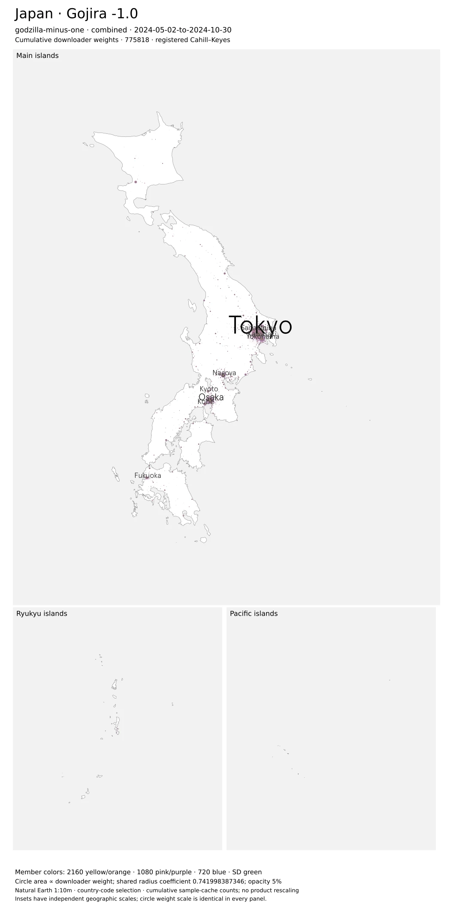
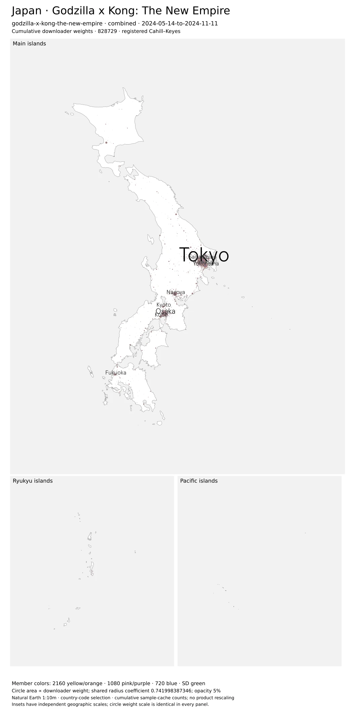
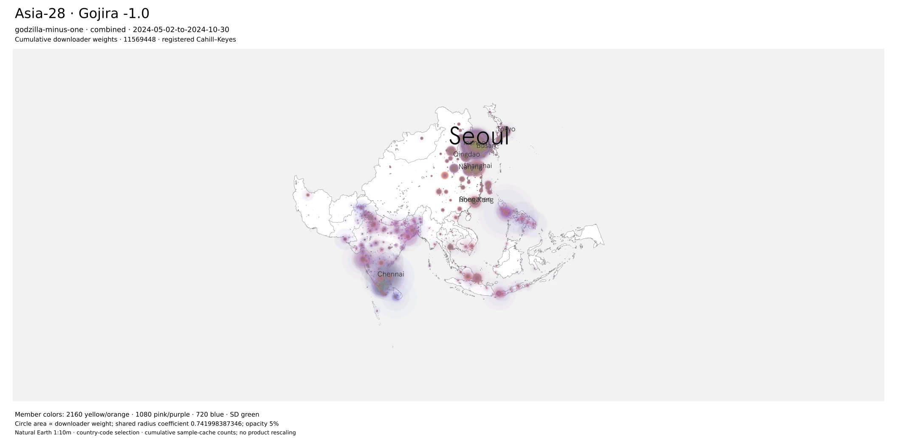
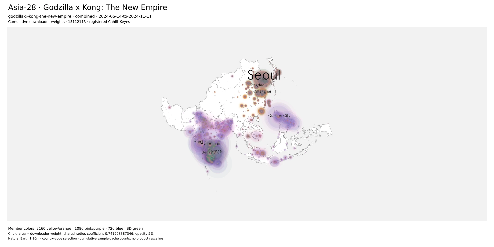

{::nomarkdown}

<link rel="stylesheet" href="../resources/izzi-table-wcag-22.css">
<link rel="stylesheet" href="../resources/mellon-7.6-analysis.css">

{:/}

[Asian American Media results](../index.html)

# Godzilla and Monarch: Japan and Asia-28

{::nomarkdown}
<link rel="stylesheet" href="../resources/mellon-7.8-stage5.css">
{:/}
## How does observed geography differ?

**Minus One has the larger Japanese share in the 2024 film pair:** 1.42% of worldwide downloader weight, compared with 1.17% for The New Empire over elapsed weeks 1–26. Across Asia-28, the shares are 23.04% and 24.50%. These are descriptive swarm observations, not viewers, nationality or a production-country effect.

The colorful maps below are **dated cumulative audit portraits**. Both film portraits and weekly comparisons span 26 weeks; the Japanese share is larger for Minus One, while Asia-28’s overall share is larger for The New Empire. Different cache and interval grains cannot be substituted for each other. Monarch appears separately as an episode-group comparison.

## Japan: two cumulative audit portraits

Circle area represents downloader weight with one shared coefficient (0.741998), **5% opacity and no display minimum**. Each geography uses the same frame and scale for both films. Yellow/orange marks identify 2160 resolution, pink/purple 1080, blue 720 and green SD. Shades identify members within each film; they do not match torrent identities between films. These are original sample caches, coalesced by unique BTIH and geolocated through the native audit renderer.

{::nomarkdown}

<figure><figcaption><strong>Godzilla Minus One</strong> · 2024-05-02-to-2024-10-30. 775,818 downloader weight. <a href="figures/godzilla-minus-one-data-country-jpn-combined-4k.webp" target="_blank" rel="noopener">3840-pixel image</a> · <a href="figures/godzilla-minus-one-data-country-jpn-combined.svg">SVG</a> · <a href="figures/godzilla-minus-one-data-country-jpn.json">Accounting and layout</a>.</figcaption></figure>
<figure><figcaption><strong>The New Empire</strong> · 2024-05-14-to-2024-11-11. 828,729 downloader weight. <a href="figures/godzilla-x-kong-the-new-empire-data-country-jpn-combined-4k.webp" target="_blank" rel="noopener">3840-pixel image</a> · <a href="figures/godzilla-x-kong-the-new-empire-data-country-jpn-combined.svg">SVG</a> · <a href="figures/godzilla-x-kong-the-new-empire-data-country-jpn.json">Accounting and layout</a>.</figcaption></figure>

{:/}

## Asia-28: the same films, one regional frame

Membership is the frozen set of 28 ISO-3 codes, including MAC and TWN once each. Neighboring country-coded observations are excluded.

{::nomarkdown}

<figure><figcaption><strong>Godzilla Minus One</strong> · 2024-05-02-to-2024-10-30. 11,569,448 downloader weight. <a href="figures/godzilla-minus-one-data-country-asia-28-combined-4k.webp" target="_blank" rel="noopener">3840-pixel image</a> · <a href="figures/godzilla-minus-one-data-country-asia-28-combined.svg">SVG</a> · <a href="figures/godzilla-minus-one-data-country-asia-28.json">Accounting and layout</a>.</figcaption></figure>
<figure><figcaption><strong>The New Empire</strong> · 2024-05-14-to-2024-11-11. 15,112,113 downloader weight. <a href="figures/godzilla-x-kong-the-new-empire-data-country-asia-28-combined-4k.webp" target="_blank" rel="noopener">3840-pixel image</a> · <a href="figures/godzilla-x-kong-the-new-empire-data-country-asia-28-combined.svg">SVG</a> · <a href="figures/godzilla-x-kong-the-new-empire-data-country-asia-28.json">Accounting and layout</a>.</figcaption></figure>

{:/}

Cache accounting and member colors

[Complete map manifest](../data/mellon-7.8/runs/20261008-stage5-gojira-v1/cache-map-manifest.json), [accounting](../data/mellon-7.8/runs/20261008-stage5-gojira-v1/cache-accounting.json), and inventories for [Minus One](../data/mellon-7.8/runs/20261008-stage5-gojira-v1/godzilla-minus-one-cache-inputs.json) and [The New Empire](../data/mellon-7.8/runs/20261008-stage5-gojira-v1/godzilla-x-kong-the-new-empire-cache-inputs.json) record the actual resolution assignments, shades, source hashes, coordinates and per-member totals. The snapshots span May 2–October 30 and May 14–November 11, 2024: exactly 26 weeks each, matching the interval comparisons. Cache weights count cumulative unique-BTIH observations; interval weights sum repeated observations across weeks, so their totals differ. Repeated views do not add observations to totals.

## Hot and cold locations

**Minus One compared with The New Empire. Red circle — Hot: a larger share for Minus One. Blue circle — Cold: a smaller share for Minus One.** These signs describe relative share, without a significance or demand claim. Every marker has the same radius. Zero differences have no sign marker.

### Selected shared cities

The historical selection rule is reapplied to 26 weeks: shared identified cities, at least 100 combined downloader weight, and at most two cities of each sign per country. Shares pool weeks 1–26 using each film’s own worldwide denominator. Focus or hover a circle for its values.

{::nomarkdown}
<figure class="analysis-figure">

<figcaption>Fixed-size red/blue circles; selected shared cities; pooled worldwide downloader shares, weeks 1–26. Sampling years differ in the historical comparison. <a href="../resources/mellon-7.8-stage5-city-films.svg">Download SVG</a>.</figcaption>

</figure>
{:/}

| City | First share | Second share | Difference (pp) |
| --- | --- | --- | --- |
| Tokyo | 0.366234% | 0.295076% | +0.071 |
| Kawasaki | 0.037447% | 0.007724% | +0.030 |
| Asagaya-minami | 0.011934% | 0.027444% | -0.016 |
| Yokohama | 0.088320% | 0.095642% | -0.007 |
| New York City | 0.440109% | 0.340308% | +0.100 |
| Los Angeles | 0.402800% | 0.332716% | +0.070 |
| Newark | 0.046710% | 0.148920% | -0.102 |
| Ashburn | 1.078466% | 1.152573% | -0.074 |
| Shanghai | 0.909735% | 0.783772% | +0.126 |
| Nanjing | 0.807603% | 0.689311% | +0.118 |
| Xiuying | 0.002836% | 0.005529% | -0.003 |
| Qionghai | 0.016731% | 0.016980% | -0.000248547 |
| Seoul | 3.430831% | 2.915420% | +0.515 |
| Incheon | 0.821055% | 0.694562% | +0.126 |
| Gunpo | 0.024660% | 0.049618% | -0.025 |
| Seolcheon | 0.000050% | 0.000205% | -0.000154587 |

Historical context: Minus One compared with Vs. Kong (2021)

{::nomarkdown}
<figure class="analysis-figure">

<figcaption>Fixed-size red/blue circles; selected shared cities; pooled worldwide downloader shares, weeks 1–26. Sampling years differ in the historical comparison. <a href="../resources/mellon-7.8-stage5-city-historical-film.svg">Download SVG</a>.</figcaption>

</figure>
{:/}

| City | First share | Second share | Difference (pp) |
| --- | --- | --- | --- |
| Ōi | 0.039056% | 0.008329% | +0.031 |
| Inzai | 0.015761% | 0.003937% | +0.012 |
| Asagaya-minami | 0.011934% | 0.684257% | -0.672 |
| Tokyo | 0.366234% | 0.681740% | -0.316 |
| Miami | 0.213715% | 0.133529% | +0.080 |
| Leesburg | 0.135288% | 0.118167% | +0.017 |
| Columbus | 0.122384% | 1.867596% | -1.745 |
| Seattle | 0.162042% | 1.184813% | -1.023 |
| Nanjing | 0.807603% | 0.325318% | +0.482 |
| Qingdao | 0.482567% | 0.196715% | +0.286 |
| Beijing | 0.319577% | 0.682590% | -0.363 |
| Shenzhen | 0.331062% | 0.652867% | -0.322 |
| Seoul | 3.430831% | 1.266598% | +2.164 |
| Incheon | 0.821055% | 0.211118% | +0.610 |
| Damyang | 0.000299% | 0.001608% | -0.001 |

### H3 resolution 5: complete aligned weekly support

These maps use the **mean of aligned weekly cell-share differences**, unlike the pooled city comparison. A cell receives a sign only when both films have observations in every selected interval. Partial/common-period values remain diagnostic downloads. Missing or suppressed cells are unavailable, never zero. The country/regional curves below support broader comparisons when the common mask is sparse.

#### Japan · full

167 comparable cells from 541 observed union cells; weeks 1, 2, 3, 4, 5, 6, 7, 8, 9, 10, 11, 12, 13, 14, 15, 16, 17, 18, 19, 20, 21, 22, 23, 24, 25, 26. The mask retains 96.97% / 96.95% of the films’ regional downloader weights. Worldwide denominators still define the shares.

{::nomarkdown}

Hot: Minus One larger shareCold: Minus One smaller share

<label>Role <select data-role><option value="downloaders">Downloaders</option><option value="uploaders">Uploaders</option></select></label><label>Network weights <select data-mode><option value="all">All observations</option><option value="without-hosting">Hosting excluded</option></select></label><label><input type="checkbox" data-coverage> Show unavailable cells as neutral outlines</label>

Loading exact values. The download contains the complete comparison.



Exact cell shares and coverage

<table><thead><tr><th>H3 ID</th><th>Sign</th><th>Minus One</th><th>The New Empire</th><th>Difference (pp)</th><th>Common intervals</th></tr></thead><tbody></tbody></table>

<a href="../data/mellon-7.8/runs/20261008-stage5-gojira-v1/h3-films-jpn-full.geojson">Complete resolution-5 GeoJSON</a> · <a href="../data/mellon-7.8/runs/20261008-stage5-gojira-v1/h3-films-jpn-full-coverage.csv">Coverage and partial-period diagnostics</a> · <a href="../resources/mellon-7.8-stage5-h3-films-jpn-full.svg">Native SVG</a>

{:/}

#### Japan · jointly-eligible

175 comparable cells from 528 observed union cells; weeks 3, 6, 7, 8, 9, 12, 13, 14, 15, 16, 17, 18, 19, 20, 21, 22, 23, 24, 25, 26. The mask retains 97.19% / 97.19% of the films’ regional downloader weights. Worldwide denominators still define the shares.

{::nomarkdown}

Hot: Minus One larger shareCold: Minus One smaller share

<label>Role <select data-role><option value="downloaders">Downloaders</option><option value="uploaders">Uploaders</option></select></label><label>Network weights <select data-mode><option value="all">All observations</option><option value="without-hosting">Hosting excluded</option></select></label><label><input type="checkbox" data-coverage> Show unavailable cells as neutral outlines</label>

Loading exact values. The download contains the complete comparison.



Exact cell shares and coverage

<table><thead><tr><th>H3 ID</th><th>Sign</th><th>Minus One</th><th>The New Empire</th><th>Difference (pp)</th><th>Common intervals</th></tr></thead><tbody></tbody></table>

<a href="../data/mellon-7.8/runs/20261008-stage5-gojira-v1/h3-films-jpn-jointly-eligible.geojson">Complete resolution-5 GeoJSON</a> · <a href="../data/mellon-7.8/runs/20261008-stage5-gojira-v1/h3-films-jpn-jointly-eligible-coverage.csv">Coverage and partial-period diagnostics</a> · <a href="../resources/mellon-7.8-stage5-h3-films-jpn-jointly-eligible.svg">Native SVG</a>

{:/}

#### Asia-28 · full

845 comparable cells from 3,994 observed union cells; weeks 1, 2, 3, 4, 5, 6, 7, 8, 9, 10, 11, 12, 13, 14, 15, 16, 17, 18, 19, 20, 21, 22, 23, 24, 25, 26. The mask retains 98.22% / 97.48% of the films’ regional downloader weights. Worldwide denominators still define the shares.

{::nomarkdown}

Hot: Minus One larger shareCold: Minus One smaller share

<label>Role <select data-role><option value="downloaders">Downloaders</option><option value="uploaders">Uploaders</option></select></label><label>Network weights <select data-mode><option value="all">All observations</option><option value="without-hosting">Hosting excluded</option></select></label><label><input type="checkbox" data-coverage> Show unavailable cells as neutral outlines</label>

Loading exact values. The download contains the complete comparison.



Exact cell shares and coverage

<table><thead><tr><th>H3 ID</th><th>Sign</th><th>Minus One</th><th>The New Empire</th><th>Difference (pp)</th><th>Common intervals</th></tr></thead><tbody></tbody></table>

<a href="../data/mellon-7.8/runs/20261008-stage5-gojira-v1/h3-films-asia-28-full.geojson">Complete resolution-5 GeoJSON</a> · <a href="../data/mellon-7.8/runs/20261008-stage5-gojira-v1/h3-films-asia-28-full-coverage.csv">Coverage and partial-period diagnostics</a> · <a href="../resources/mellon-7.8-stage5-h3-films-asia-28-full.svg">Native SVG</a>

{:/}

#### Asia-28 · jointly-eligible

864 comparable cells from 3,615 observed union cells; weeks 3, 6, 7, 8, 9, 12, 13, 14, 15, 16, 17, 18, 19, 20, 21, 22, 23, 24, 25, 26. The mask retains 98.51% / 97.81% of the films’ regional downloader weights. Worldwide denominators still define the shares.

{::nomarkdown}

Hot: Minus One larger shareCold: Minus One smaller share

<label>Role <select data-role><option value="downloaders">Downloaders</option><option value="uploaders">Uploaders</option></select></label><label>Network weights <select data-mode><option value="all">All observations</option><option value="without-hosting">Hosting excluded</option></select></label><label><input type="checkbox" data-coverage> Show unavailable cells as neutral outlines</label>

Loading exact values. The download contains the complete comparison.



Exact cell shares and coverage

<table><thead><tr><th>H3 ID</th><th>Sign</th><th>Minus One</th><th>The New Empire</th><th>Difference (pp)</th><th>Common intervals</th></tr></thead><tbody></tbody></table>

<a href="../data/mellon-7.8/runs/20261008-stage5-gojira-v1/h3-films-asia-28-jointly-eligible.geojson">Complete resolution-5 GeoJSON</a> · <a href="../data/mellon-7.8/runs/20261008-stage5-gojira-v1/h3-films-asia-28-jointly-eligible-coverage.csv">Coverage and partial-period diagnostics</a> · <a href="../resources/mellon-7.8-stage5-h3-films-asia-28-jointly-eligible.svg">Native SVG</a>

{:/}

## Regional share trajectories and coverage

Japan, USA, China and South Korea precede Asia-28, EUR-27 and USA–Canada. Every numerator uses the same work, interval, role and hosting treatment as its worldwide denominator. These overlapping country/region views are not a partition. Counts remain observed weights, not viewers. On narrow screens, scroll each chart sideways to see all 26 weeks.

### Godzilla Minus One / The New Empire

Requested window: weeks 1–26; paired available window: weeks **1, 2, 3, 4, 5, 6, 7, 8, 9, 10, 11, 12, 13, 14, 15, 16, 17, 18, 19, 20, 21, 22, 23, 24, 25, 26**. All 26 weeks are available for both objects. Jointly eligible sensitivity: weeks **3, 6, 7, 8, 9, 12, 13, 14, 15, 16, 17, 18, 19, 20, 21, 22, 23, 24, 25, 26**. Windows were selected from boundary flags and audit gaps before comparing effects.

{::nomarkdown}
<figure class="analysis-figure">

<figcaption>Weekly geographic shares with matching worldwide denominators. Hosting exclusion does not establish residential traffic. <a href="../resources/mellon-7.8-stage5-films-downloaders-all-weekly.svg">Download SVG</a>.</figcaption>

</figure>
{:/}

Downloaders: hosting-excluded trajectories

{::nomarkdown}
<figure class="analysis-figure">

<figcaption>Weekly geographic shares with matching worldwide denominators. Hosting exclusion does not establish residential traffic. <a href="../resources/mellon-7.8-stage5-films-downloaders-without-hosting-weekly.svg">Download SVG</a>.</figcaption>

</figure>
{:/}

{::nomarkdown}
<figure class="analysis-figure">

<figcaption>Weekly geographic shares with matching worldwide denominators. Hosting exclusion does not establish residential traffic. <a href="../resources/mellon-7.8-stage5-films-uploaders-all-weekly.svg">Download SVG</a>.</figcaption>

</figure>
{:/}

Uploaders: hosting-excluded trajectories

{::nomarkdown}
<figure class="analysis-figure">

<figcaption>Weekly geographic shares with matching worldwide denominators. Hosting exclusion does not establish residential traffic. <a href="../resources/mellon-7.8-stage5-films-uploaders-without-hosting-weekly.svg">Download SVG</a>.</figcaption>

</figure>
{:/}

Both roles: full-window and jointly eligible counts and shares

| Object | Region | Role | Treatment | Window | Regional weight | Worldwide weight | Share | World weight retained |
| --- | --- | --- | --- | --- | --- | --- | --- | --- |
| Godzilla Minus One | Japan | downloaders | all | full | 845,181 | 59,475,882 | 1.42% | 100.00% |
| Godzilla Minus One | Japan | downloaders | without-hosting | full | 738,329 | 50,049,595 | 1.48% | 100.00% |
| Godzilla Minus One | Japan | uploaders | all | full | 31,057 | 4,720,356 | 0.66% | 100.00% |
| Godzilla Minus One | Japan | uploaders | without-hosting | full | 19,220 | 3,641,550 | 0.53% | 100.00% |
| Godzilla Minus One | USA | downloaders | all | full | 4,438,835 | 59,475,882 | 7.46% | 100.00% |
| Godzilla Minus One | USA | downloaders | without-hosting | full | 2,294,675 | 50,049,595 | 4.58% | 100.00% |
| Godzilla Minus One | USA | uploaders | all | full | 629,640 | 4,720,356 | 13.34% | 100.00% |
| Godzilla Minus One | USA | uploaders | without-hosting | full | 185,556 | 3,641,550 | 5.10% | 100.00% |
| Godzilla Minus One | China | downloaders | all | full | 3,123,446 | 59,475,882 | 5.25% | 100.00% |
| Godzilla Minus One | China | downloaders | without-hosting | full | 2,949,389 | 50,049,595 | 5.89% | 100.00% |
| Godzilla Minus One | China | uploaders | all | full | 153,968 | 4,720,356 | 3.26% | 100.00% |
| Godzilla Minus One | China | uploaders | without-hosting | full | 140,570 | 3,641,550 | 3.86% | 100.00% |
| Godzilla Minus One | South Korea | downloaders | all | full | 5,473,245 | 59,475,882 | 9.20% | 100.00% |
| Godzilla Minus One | South Korea | downloaders | without-hosting | full | 5,320,509 | 50,049,595 | 10.63% | 100.00% |
| Godzilla Minus One | South Korea | uploaders | all | full | 42,328 | 4,720,356 | 0.90% | 100.00% |
| Godzilla Minus One | South Korea | uploaders | without-hosting | full | 40,542 | 3,641,550 | 1.11% | 100.00% |
| Godzilla Minus One | Asia-28 | downloaders | all | full | 13,701,175 | 59,475,882 | 23.04% | 100.00% |
| Godzilla Minus One | Asia-28 | downloaders | without-hosting | full | 12,973,496 | 50,049,595 | 25.92% | 100.00% |
| Godzilla Minus One | Asia-28 | uploaders | all | full | 1,264,038 | 4,720,356 | 26.78% | 100.00% |
| Godzilla Minus One | Asia-28 | uploaders | without-hosting | full | 1,183,833 | 3,641,550 | 32.51% | 100.00% |
| Godzilla Minus One | EUR-27 | downloaders | all | full | 12,586,634 | 59,475,882 | 21.16% | 100.00% |
| Godzilla Minus One | EUR-27 | downloaders | without-hosting | full | 7,982,224 | 50,049,595 | 15.95% | 100.00% |
| Godzilla Minus One | EUR-27 | uploaders | all | full | 789,686 | 4,720,356 | 16.73% | 100.00% |
| Godzilla Minus One | EUR-27 | uploaders | without-hosting | full | 527,755 | 3,641,550 | 14.49% | 100.00% |
| Godzilla Minus One | USA–Canada | downloaders | all | full | 6,005,431 | 59,475,882 | 10.10% | 100.00% |
| Godzilla Minus One | USA–Canada | downloaders | without-hosting | full | 3,285,705 | 50,049,595 | 6.56% | 100.00% |
| Godzilla Minus One | USA–Canada | uploaders | all | full | 894,642 | 4,720,356 | 18.95% | 100.00% |
| Godzilla Minus One | USA–Canada | uploaders | without-hosting | full | 317,088 | 3,641,550 | 8.71% | 100.00% |
| The New Empire | Japan | downloaders | all | full | 900,103 | 77,062,615 | 1.17% | 100.00% |
| The New Empire | Japan | downloaders | without-hosting | full | 791,655 | 66,274,550 | 1.19% | 100.00% |
| The New Empire | Japan | uploaders | all | full | 28,570 | 9,683,536 | 0.30% | 100.00% |
| The New Empire | Japan | uploaders | without-hosting | full | 18,756 | 8,251,882 | 0.23% | 100.00% |
| The New Empire | USA | downloaders | all | full | 5,225,342 | 77,062,615 | 6.78% | 100.00% |
| The New Empire | USA | downloaders | without-hosting | full | 2,723,394 | 66,274,550 | 4.11% | 100.00% |
| The New Empire | USA | uploaders | all | full | 879,419 | 9,683,536 | 9.08% | 100.00% |
| The New Empire | USA | uploaders | without-hosting | full | 297,239 | 8,251,882 | 3.60% | 100.00% |
| The New Empire | China | downloaders | all | full | 3,454,173 | 77,062,615 | 4.48% | 100.00% |
| The New Empire | China | downloaders | without-hosting | full | 3,265,692 | 66,274,550 | 4.93% | 100.00% |
| The New Empire | China | uploaders | all | full | 194,048 | 9,683,536 | 2.00% | 100.00% |
| The New Empire | China | uploaders | without-hosting | full | 180,393 | 8,251,882 | 2.19% | 100.00% |
| The New Empire | South Korea | downloaders | all | full | 6,019,855 | 77,062,615 | 7.81% | 100.00% |
| The New Empire | South Korea | downloaders | without-hosting | full | 5,853,298 | 66,274,550 | 8.83% | 100.00% |
| The New Empire | South Korea | uploaders | all | full | 92,840 | 9,683,536 | 0.96% | 100.00% |
| The New Empire | South Korea | uploaders | without-hosting | full | 90,298 | 8,251,882 | 1.09% | 100.00% |
| The New Empire | Asia-28 | downloaders | all | full | 18,880,461 | 77,062,615 | 24.50% | 100.00% |
| The New Empire | Asia-28 | downloaders | without-hosting | full | 18,048,806 | 66,274,550 | 27.23% | 100.00% |
| The New Empire | Asia-28 | uploaders | all | full | 2,555,177 | 9,683,536 | 26.39% | 100.00% |
| The New Empire | Asia-28 | uploaders | without-hosting | full | 2,463,025 | 8,251,882 | 29.85% | 100.00% |
| The New Empire | EUR-27 | downloaders | all | full | 15,093,698 | 77,062,615 | 19.59% | 100.00% |
| The New Empire | EUR-27 | downloaders | without-hosting | full | 10,025,423 | 66,274,550 | 15.13% | 100.00% |
| The New Empire | EUR-27 | uploaders | all | full | 1,285,242 | 9,683,536 | 13.27% | 100.00% |
| The New Empire | EUR-27 | uploaders | without-hosting | full | 962,835 | 8,251,882 | 11.67% | 100.00% |
| The New Empire | USA–Canada | downloaders | all | full | 6,997,362 | 77,062,615 | 9.08% | 100.00% |
| The New Empire | USA–Canada | downloaders | without-hosting | full | 3,868,428 | 66,274,550 | 5.84% | 100.00% |
| The New Empire | USA–Canada | uploaders | all | full | 1,170,397 | 9,683,536 | 12.09% | 100.00% |
| The New Empire | USA–Canada | uploaders | without-hosting | full | 465,431 | 8,251,882 | 5.64% | 100.00% |
| Godzilla Minus One | Japan | downloaders | all | jointly-eligible | 662,303 | 46,074,710 | 1.44% | 77.47% |
| Godzilla Minus One | Japan | downloaders | without-hosting | jointly-eligible | 581,846 | 38,788,996 | 1.50% | 77.50% |
| Godzilla Minus One | Japan | uploaders | all | jointly-eligible | 18,285 | 2,711,723 | 0.67% | 57.45% |
| Godzilla Minus One | Japan | uploaders | without-hosting | jointly-eligible | 10,441 | 1,988,869 | 0.52% | 54.62% |
| Godzilla Minus One | USA | downloaders | all | jointly-eligible | 3,348,036 | 46,074,710 | 7.27% | 77.47% |
| Godzilla Minus One | USA | downloaders | without-hosting | jointly-eligible | 1,731,712 | 38,788,996 | 4.46% | 77.50% |
| Godzilla Minus One | USA | uploaders | all | jointly-eligible | 416,711 | 2,711,723 | 15.37% | 57.45% |
| Godzilla Minus One | USA | uploaders | without-hosting | jointly-eligible | 106,360 | 1,988,869 | 5.35% | 54.62% |
| Godzilla Minus One | China | downloaders | all | jointly-eligible | 2,473,398 | 46,074,710 | 5.37% | 77.47% |
| Godzilla Minus One | China | downloaders | without-hosting | jointly-eligible | 2,330,367 | 38,788,996 | 6.01% | 77.50% |
| Godzilla Minus One | China | uploaders | all | jointly-eligible | 91,619 | 2,711,723 | 3.38% | 57.45% |
| Godzilla Minus One | China | uploaders | without-hosting | jointly-eligible | 80,329 | 1,988,869 | 4.04% | 54.62% |
| Godzilla Minus One | South Korea | downloaders | all | jointly-eligible | 4,429,899 | 46,074,710 | 9.61% | 77.47% |
| Godzilla Minus One | South Korea | downloaders | without-hosting | jointly-eligible | 4,307,842 | 38,788,996 | 11.11% | 77.50% |
| Godzilla Minus One | South Korea | uploaders | all | jointly-eligible | 22,901 | 2,711,723 | 0.84% | 57.45% |
| Godzilla Minus One | South Korea | uploaders | without-hosting | jointly-eligible | 21,787 | 1,988,869 | 1.10% | 54.62% |
| Godzilla Minus One | Asia-28 | downloaders | all | jointly-eligible | 10,304,433 | 46,074,710 | 22.36% | 77.47% |
| Godzilla Minus One | Asia-28 | downloaders | without-hosting | jointly-eligible | 9,749,324 | 38,788,996 | 25.13% | 77.50% |
| Godzilla Minus One | Asia-28 | uploaders | all | jointly-eligible | 691,961 | 2,711,723 | 25.52% | 57.45% |
| Godzilla Minus One | Asia-28 | uploaders | without-hosting | jointly-eligible | 638,805 | 1,988,869 | 32.12% | 54.62% |
| Godzilla Minus One | EUR-27 | downloaders | all | jointly-eligible | 9,901,621 | 46,074,710 | 21.49% | 77.47% |
| Godzilla Minus One | EUR-27 | downloaders | without-hosting | jointly-eligible | 6,265,057 | 38,788,996 | 16.15% | 77.50% |
| Godzilla Minus One | EUR-27 | uploaders | all | jointly-eligible | 467,847 | 2,711,723 | 17.25% | 57.45% |
| Godzilla Minus One | EUR-27 | uploaders | without-hosting | jointly-eligible | 299,146 | 1,988,869 | 15.04% | 54.62% |
| Godzilla Minus One | USA–Canada | downloaders | all | jointly-eligible | 4,555,933 | 46,074,710 | 9.89% | 77.47% |
| Godzilla Minus One | USA–Canada | downloaders | without-hosting | jointly-eligible | 2,496,085 | 38,788,996 | 6.44% | 77.50% |
| Godzilla Minus One | USA–Canada | uploaders | all | jointly-eligible | 599,566 | 2,711,723 | 22.11% | 57.45% |
| Godzilla Minus One | USA–Canada | uploaders | without-hosting | jointly-eligible | 192,091 | 1,988,869 | 9.66% | 54.62% |
| The New Empire | Japan | downloaders | all | jointly-eligible | 672,146 | 55,499,798 | 1.21% | 72.02% |
| The New Empire | Japan | downloaders | without-hosting | jointly-eligible | 594,798 | 47,597,043 | 1.25% | 71.82% |
| The New Empire | Japan | uploaders | all | jointly-eligible | 16,546 | 5,435,520 | 0.30% | 56.13% |
| The New Empire | Japan | uploaders | without-hosting | jointly-eligible | 10,380 | 4,505,872 | 0.23% | 54.60% |
| The New Empire | USA | downloaders | all | jointly-eligible | 3,730,464 | 55,499,798 | 6.72% | 72.02% |
| The New Empire | USA | downloaders | without-hosting | jointly-eligible | 1,929,332 | 47,597,043 | 4.05% | 71.82% |
| The New Empire | USA | uploaders | all | jointly-eligible | 565,418 | 5,435,520 | 10.40% | 56.13% |
| The New Empire | USA | uploaders | without-hosting | jointly-eligible | 167,728 | 4,505,872 | 3.72% | 54.60% |
| The New Empire | China | downloaders | all | jointly-eligible | 2,582,630 | 55,499,798 | 4.65% | 72.02% |
| The New Empire | China | downloaders | without-hosting | jointly-eligible | 2,434,745 | 47,597,043 | 5.12% | 71.82% |
| The New Empire | China | uploaders | all | jointly-eligible | 110,981 | 5,435,520 | 2.04% | 56.13% |
| The New Empire | China | uploaders | without-hosting | jointly-eligible | 100,083 | 4,505,872 | 2.22% | 54.60% |
| The New Empire | South Korea | downloaders | all | jointly-eligible | 4,574,585 | 55,499,798 | 8.24% | 72.02% |
| The New Empire | South Korea | downloaders | without-hosting | jointly-eligible | 4,449,325 | 47,597,043 | 9.35% | 71.82% |
| The New Empire | South Korea | uploaders | all | jointly-eligible | 38,205 | 5,435,520 | 0.70% | 56.13% |
| The New Empire | South Korea | uploaders | without-hosting | jointly-eligible | 36,818 | 4,505,872 | 0.82% | 54.60% |
| The New Empire | Asia-28 | downloaders | all | jointly-eligible | 13,031,429 | 55,499,798 | 23.48% | 72.02% |
| The New Empire | Asia-28 | downloaders | without-hosting | jointly-eligible | 12,432,188 | 47,597,043 | 26.12% | 71.82% |
| The New Empire | Asia-28 | uploaders | all | jointly-eligible | 1,430,667 | 5,435,520 | 26.32% | 56.13% |
| The New Empire | Asia-28 | uploaders | without-hosting | jointly-eligible | 1,373,001 | 4,505,872 | 30.47% | 54.60% |
| The New Empire | EUR-27 | downloaders | all | jointly-eligible | 11,213,540 | 55,499,798 | 20.20% | 72.02% |
| The New Empire | EUR-27 | downloaders | without-hosting | jointly-eligible | 7,415,238 | 47,597,043 | 15.58% | 71.82% |
| The New Empire | EUR-27 | uploaders | all | jointly-eligible | 720,993 | 5,435,520 | 13.26% | 56.13% |
| The New Empire | EUR-27 | uploaders | without-hosting | jointly-eligible | 518,797 | 4,505,872 | 11.51% | 54.60% |
| The New Empire | USA–Canada | downloaders | all | jointly-eligible | 5,009,254 | 55,499,798 | 9.03% | 72.02% |
| The New Empire | USA–Canada | downloaders | without-hosting | jointly-eligible | 2,753,688 | 47,597,043 | 5.79% | 71.82% |
| The New Empire | USA–Canada | uploaders | all | jointly-eligible | 745,408 | 5,435,520 | 13.71% | 56.13% |
| The New Empire | USA–Canada | uploaders | without-hosting | jointly-eligible | 266,449 | 4,505,872 | 5.91% | 54.60% |

## Monarch: three-episode groups in 2026

Monarch 201–203 and 208–210 are both three-episode samples. They occupy different release positions; matching elapsed indices does not align calendar dates. Monarch 101–103 remains earlier-season context and Monarch 110 is a single episode.

### Monarch 201–203 / Monarch 208–210

Requested window: weeks 1–26; paired available window: weeks **1, 2, 3, 4, 5, 6, 7, 8, 9, 10, 11, 12, 13, 14, 15, 16, 17, 18, 19, 20, 21, 22, 23, 24**. The shorter sample ends before week 26; no missing weeks are treated as zero, and pair summaries use only the available common weeks. Jointly eligible sensitivity: weeks **2, 3, 4, 6, 7, 8, 9, 12, 14, 15, 16, 18, 20, 21, 22, 23**. Windows were selected from boundary flags and audit gaps before comparing effects.

{::nomarkdown}
<figure class="analysis-figure">

<figcaption>Weekly geographic shares with matching worldwide denominators. Hosting exclusion does not establish residential traffic. <a href="../resources/mellon-7.8-stage5-monarch-downloaders-all-weekly.svg">Download SVG</a>.</figcaption>

</figure>
{:/}

Downloaders: hosting-excluded trajectories

{::nomarkdown}
<figure class="analysis-figure">

<figcaption>Weekly geographic shares with matching worldwide denominators. Hosting exclusion does not establish residential traffic. <a href="../resources/mellon-7.8-stage5-monarch-downloaders-without-hosting-weekly.svg">Download SVG</a>.</figcaption>

</figure>
{:/}

{::nomarkdown}
<figure class="analysis-figure">

<figcaption>Weekly geographic shares with matching worldwide denominators. Hosting exclusion does not establish residential traffic. <a href="../resources/mellon-7.8-stage5-monarch-uploaders-all-weekly.svg">Download SVG</a>.</figcaption>

</figure>
{:/}

Uploaders: hosting-excluded trajectories

{::nomarkdown}
<figure class="analysis-figure">

<figcaption>Weekly geographic shares with matching worldwide denominators. Hosting exclusion does not establish residential traffic. <a href="../resources/mellon-7.8-stage5-monarch-uploaders-without-hosting-weekly.svg">Download SVG</a>.</figcaption>

</figure>
{:/}

Both roles: full-window and jointly eligible counts and shares

| Object | Region | Role | Treatment | Window | Regional weight | Worldwide weight | Share | World weight retained |
| --- | --- | --- | --- | --- | --- | --- | --- | --- |
| Monarch 201–203 | Japan | downloaders | all | full | 831,016 | 65,796,816 | 1.26% | 93.36% |
| Monarch 201–203 | Japan | downloaders | without-hosting | full | 711,501 | 54,525,920 | 1.30% | 93.23% |
| Monarch 201–203 | Japan | uploaders | all | full | 10,494 | 2,901,030 | 0.36% | 97.07% |
| Monarch 201–203 | Japan | uploaders | without-hosting | full | 4,114 | 1,879,169 | 0.22% | 97.08% |
| Monarch 201–203 | USA | downloaders | all | full | 4,594,578 | 65,796,816 | 6.98% | 93.36% |
| Monarch 201–203 | USA | downloaders | without-hosting | full | 2,240,629 | 54,525,920 | 4.11% | 93.23% |
| Monarch 201–203 | USA | uploaders | all | full | 565,876 | 2,901,030 | 19.51% | 97.07% |
| Monarch 201–203 | USA | uploaders | without-hosting | full | 118,539 | 1,879,169 | 6.31% | 97.08% |
| Monarch 201–203 | China | downloaders | all | full | 6,621,882 | 65,796,816 | 10.06% | 93.36% |
| Monarch 201–203 | China | downloaders | without-hosting | full | 6,278,755 | 54,525,920 | 11.52% | 93.23% |
| Monarch 201–203 | China | uploaders | all | full | 345,882 | 2,901,030 | 11.92% | 97.07% |
| Monarch 201–203 | China | uploaders | without-hosting | full | 343,312 | 1,879,169 | 18.27% | 97.08% |
| Monarch 201–203 | South Korea | downloaders | all | full | 9,230,248 | 65,796,816 | 14.03% | 93.36% |
| Monarch 201–203 | South Korea | downloaders | without-hosting | full | 9,025,437 | 54,525,920 | 16.55% | 93.23% |
| Monarch 201–203 | South Korea | uploaders | all | full | 13,985 | 2,901,030 | 0.48% | 97.07% |
| Monarch 201–203 | South Korea | uploaders | without-hosting | full | 13,043 | 1,879,169 | 0.69% | 97.08% |
| Monarch 201–203 | Asia-28 | downloaders | all | full | 18,833,099 | 65,796,816 | 28.62% | 93.36% |
| Monarch 201–203 | Asia-28 | downloaders | without-hosting | full | 17,924,098 | 54,525,920 | 32.87% | 93.23% |
| Monarch 201–203 | Asia-28 | uploaders | all | full | 619,134 | 2,901,030 | 21.34% | 97.07% |
| Monarch 201–203 | Asia-28 | uploaders | without-hosting | full | 580,278 | 1,879,169 | 30.88% | 97.08% |
| Monarch 201–203 | EUR-27 | downloaders | all | full | 17,998,642 | 65,796,816 | 27.35% | 93.36% |
| Monarch 201–203 | EUR-27 | downloaders | without-hosting | full | 12,025,241 | 54,525,920 | 22.05% | 93.23% |
| Monarch 201–203 | EUR-27 | uploaders | all | full | 696,386 | 2,901,030 | 24.00% | 97.07% |
| Monarch 201–203 | EUR-27 | uploaders | without-hosting | full | 385,359 | 1,879,169 | 20.51% | 97.08% |
| Monarch 201–203 | USA–Canada | downloaders | all | full | 6,346,705 | 65,796,816 | 9.65% | 93.36% |
| Monarch 201–203 | USA–Canada | downloaders | without-hosting | full | 3,404,510 | 54,525,920 | 6.24% | 93.23% |
| Monarch 201–203 | USA–Canada | uploaders | all | full | 707,852 | 2,901,030 | 24.40% | 97.07% |
| Monarch 201–203 | USA–Canada | uploaders | without-hosting | full | 185,647 | 1,879,169 | 9.88% | 97.08% |
| Monarch 208–210 | Japan | downloaders | all | full | 853,976 | 68,978,490 | 1.24% | 100.00% |
| Monarch 208–210 | Japan | downloaders | without-hosting | full | 736,488 | 57,679,166 | 1.28% | 100.00% |
| Monarch 208–210 | Japan | uploaders | all | full | 8,669 | 2,277,579 | 0.38% | 100.00% |
| Monarch 208–210 | Japan | uploaders | without-hosting | full | 2,915 | 1,460,889 | 0.20% | 100.00% |
| Monarch 208–210 | USA | downloaders | all | full | 4,815,325 | 68,978,490 | 6.98% | 100.00% |
| Monarch 208–210 | USA | downloaders | without-hosting | full | 2,492,328 | 57,679,166 | 4.32% | 100.00% |
| Monarch 208–210 | USA | uploaders | all | full | 490,526 | 2,277,579 | 21.54% | 100.00% |
| Monarch 208–210 | USA | uploaders | without-hosting | full | 108,117 | 1,460,889 | 7.40% | 100.00% |
| Monarch 208–210 | China | downloaders | all | full | 6,917,361 | 68,978,490 | 10.03% | 100.00% |
| Monarch 208–210 | China | downloaders | without-hosting | full | 6,572,429 | 57,679,166 | 11.39% | 100.00% |
| Monarch 208–210 | China | uploaders | all | full | 387,573 | 2,277,579 | 17.02% | 100.00% |
| Monarch 208–210 | China | uploaders | without-hosting | full | 384,451 | 1,460,889 | 26.32% | 100.00% |
| Monarch 208–210 | South Korea | downloaders | all | full | 9,036,059 | 68,978,490 | 13.10% | 100.00% |
| Monarch 208–210 | South Korea | downloaders | without-hosting | full | 8,834,791 | 57,679,166 | 15.32% | 100.00% |
| Monarch 208–210 | South Korea | uploaders | all | full | 9,592 | 2,277,579 | 0.42% | 100.00% |
| Monarch 208–210 | South Korea | uploaders | without-hosting | full | 8,836 | 1,460,889 | 0.60% | 100.00% |
| Monarch 208–210 | Asia-28 | downloaders | all | full | 18,853,286 | 68,978,490 | 27.33% | 100.00% |
| Monarch 208–210 | Asia-28 | downloaders | without-hosting | full | 17,962,300 | 57,679,166 | 31.14% | 100.00% |
| Monarch 208–210 | Asia-28 | uploaders | all | full | 566,014 | 2,277,579 | 24.85% | 100.00% |
| Monarch 208–210 | Asia-28 | uploaders | without-hosting | full | 534,059 | 1,460,889 | 36.56% | 100.00% |
| Monarch 208–210 | EUR-27 | downloaders | all | full | 20,409,603 | 68,978,490 | 29.59% | 100.00% |
| Monarch 208–210 | EUR-27 | downloaders | without-hosting | full | 14,233,932 | 57,679,166 | 24.68% | 100.00% |
| Monarch 208–210 | EUR-27 | uploaders | all | full | 519,037 | 2,277,579 | 22.79% | 100.00% |
| Monarch 208–210 | EUR-27 | uploaders | without-hosting | full | 284,648 | 1,460,889 | 19.48% | 100.00% |
| Monarch 208–210 | USA–Canada | downloaders | all | full | 6,662,266 | 68,978,490 | 9.66% | 100.00% |
| Monarch 208–210 | USA–Canada | downloaders | without-hosting | full | 3,760,917 | 57,679,166 | 6.52% | 100.00% |
| Monarch 208–210 | USA–Canada | uploaders | all | full | 601,451 | 2,277,579 | 26.41% | 100.00% |
| Monarch 208–210 | USA–Canada | uploaders | without-hosting | full | 162,254 | 1,460,889 | 11.11% | 100.00% |
| Monarch 201–203 | Japan | downloaders | all | jointly-eligible | 567,454 | 45,258,549 | 1.25% | 64.22% |
| Monarch 201–203 | Japan | downloaders | without-hosting | jointly-eligible | 485,131 | 37,508,235 | 1.29% | 64.13% |
| Monarch 201–203 | Japan | uploaders | all | jointly-eligible | 7,244 | 2,022,626 | 0.36% | 67.68% |
| Monarch 201–203 | Japan | uploaders | without-hosting | jointly-eligible | 2,954 | 1,325,670 | 0.22% | 68.48% |
| Monarch 201–203 | USA | downloaders | all | jointly-eligible | 3,159,189 | 45,258,549 | 6.98% | 64.22% |
| Monarch 201–203 | USA | downloaders | without-hosting | jointly-eligible | 1,549,814 | 37,508,235 | 4.13% | 64.13% |
| Monarch 201–203 | USA | uploaders | all | jointly-eligible | 383,947 | 2,022,626 | 18.98% | 67.68% |
| Monarch 201–203 | USA | uploaders | without-hosting | jointly-eligible | 82,732 | 1,325,670 | 6.24% | 68.48% |
| Monarch 201–203 | China | downloaders | all | jointly-eligible | 4,508,109 | 45,258,549 | 9.96% | 64.22% |
| Monarch 201–203 | China | downloaders | without-hosting | jointly-eligible | 4,275,066 | 37,508,235 | 11.40% | 64.13% |
| Monarch 201–203 | China | uploaders | all | jointly-eligible | 243,633 | 2,022,626 | 12.05% | 67.68% |
| Monarch 201–203 | China | uploaders | without-hosting | jointly-eligible | 241,748 | 1,325,670 | 18.24% | 68.48% |
| Monarch 201–203 | South Korea | downloaders | all | jointly-eligible | 6,280,860 | 45,258,549 | 13.88% | 64.22% |
| Monarch 201–203 | South Korea | downloaders | without-hosting | jointly-eligible | 6,141,746 | 37,508,235 | 16.37% | 64.13% |
| Monarch 201–203 | South Korea | uploaders | all | jointly-eligible | 10,966 | 2,022,626 | 0.54% | 67.68% |
| Monarch 201–203 | South Korea | uploaders | without-hosting | jointly-eligible | 10,304 | 1,325,670 | 0.78% | 68.48% |
| Monarch 201–203 | Asia-28 | downloaders | all | jointly-eligible | 12,842,853 | 45,258,549 | 28.38% | 64.22% |
| Monarch 201–203 | Asia-28 | downloaders | without-hosting | jointly-eligible | 12,222,424 | 37,508,235 | 32.59% | 64.13% |
| Monarch 201–203 | Asia-28 | uploaders | all | jointly-eligible | 437,464 | 2,022,626 | 21.63% | 67.68% |
| Monarch 201–203 | Asia-28 | uploaders | without-hosting | jointly-eligible | 410,512 | 1,325,670 | 30.97% | 68.48% |
| Monarch 201–203 | EUR-27 | downloaders | all | jointly-eligible | 12,384,361 | 45,258,549 | 27.36% | 64.22% |
| Monarch 201–203 | EUR-27 | downloaders | without-hosting | jointly-eligible | 8,274,349 | 37,508,235 | 22.06% | 64.13% |
| Monarch 201–203 | EUR-27 | uploaders | all | jointly-eligible | 483,790 | 2,022,626 | 23.92% | 67.68% |
| Monarch 201–203 | EUR-27 | uploaders | without-hosting | jointly-eligible | 270,986 | 1,325,670 | 20.44% | 68.48% |
| Monarch 201–203 | USA–Canada | downloaders | all | jointly-eligible | 4,376,994 | 45,258,549 | 9.67% | 64.22% |
| Monarch 201–203 | USA–Canada | downloaders | without-hosting | jointly-eligible | 2,359,608 | 37,508,235 | 6.29% | 64.13% |
| Monarch 201–203 | USA–Canada | uploaders | all | jointly-eligible | 483,720 | 2,022,626 | 23.92% | 67.68% |
| Monarch 201–203 | USA–Canada | uploaders | without-hosting | jointly-eligible | 130,035 | 1,325,670 | 9.81% | 68.48% |
| Monarch 208–210 | Japan | downloaders | all | jointly-eligible | 576,984 | 47,041,359 | 1.23% | 68.20% |
| Monarch 208–210 | Japan | downloaders | without-hosting | jointly-eligible | 495,950 | 39,361,885 | 1.26% | 68.24% |
| Monarch 208–210 | Japan | uploaders | all | jointly-eligible | 6,224 | 1,658,190 | 0.38% | 72.80% |
| Monarch 208–210 | Japan | uploaders | without-hosting | jointly-eligible | 2,037 | 1,068,757 | 0.19% | 73.16% |
| Monarch 208–210 | USA | downloaders | all | jointly-eligible | 3,310,308 | 47,041,359 | 7.04% | 68.20% |
| Monarch 208–210 | USA | downloaders | without-hosting | jointly-eligible | 1,722,694 | 39,361,885 | 4.38% | 68.24% |
| Monarch 208–210 | USA | uploaders | all | jointly-eligible | 349,594 | 1,658,190 | 21.08% | 72.80% |
| Monarch 208–210 | USA | uploaders | without-hosting | jointly-eligible | 78,095 | 1,068,757 | 7.31% | 73.16% |
| Monarch 208–210 | China | downloaders | all | jointly-eligible | 4,634,074 | 47,041,359 | 9.85% | 68.20% |
| Monarch 208–210 | China | downloaders | without-hosting | jointly-eligible | 4,406,307 | 39,361,885 | 11.19% | 68.24% |
| Monarch 208–210 | China | uploaders | all | jointly-eligible | 280,018 | 1,658,190 | 16.89% | 72.80% |
| Monarch 208–210 | China | uploaders | without-hosting | jointly-eligible | 277,970 | 1,068,757 | 26.01% | 73.16% |
| Monarch 208–210 | South Korea | downloaders | all | jointly-eligible | 5,954,874 | 47,041,359 | 12.66% | 68.20% |
| Monarch 208–210 | South Korea | downloaders | without-hosting | jointly-eligible | 5,822,415 | 39,361,885 | 14.79% | 68.24% |
| Monarch 208–210 | South Korea | uploaders | all | jointly-eligible | 6,567 | 1,658,190 | 0.40% | 72.80% |
| Monarch 208–210 | South Korea | uploaders | without-hosting | jointly-eligible | 6,034 | 1,068,757 | 0.56% | 73.16% |
| Monarch 208–210 | Asia-28 | downloaders | all | jointly-eligible | 12,557,965 | 47,041,359 | 26.70% | 68.20% |
| Monarch 208–210 | Asia-28 | downloaders | without-hosting | jointly-eligible | 11,962,067 | 39,361,885 | 30.39% | 68.24% |
| Monarch 208–210 | Asia-28 | uploaders | all | jointly-eligible | 412,155 | 1,658,190 | 24.86% | 72.80% |
| Monarch 208–210 | Asia-28 | uploaders | without-hosting | jointly-eligible | 389,463 | 1,068,757 | 36.44% | 73.16% |
| Monarch 208–210 | EUR-27 | downloaders | all | jointly-eligible | 13,974,794 | 47,041,359 | 29.71% | 68.20% |
| Monarch 208–210 | EUR-27 | downloaders | without-hosting | jointly-eligible | 9,792,266 | 39,361,885 | 24.88% | 68.24% |
| Monarch 208–210 | EUR-27 | uploaders | all | jointly-eligible | 381,785 | 1,658,190 | 23.02% | 72.80% |
| Monarch 208–210 | EUR-27 | uploaders | without-hosting | jointly-eligible | 208,947 | 1,068,757 | 19.55% | 73.16% |
| Monarch 208–210 | USA–Canada | downloaders | all | jointly-eligible | 4,574,410 | 47,041,359 | 9.72% | 68.20% |
| Monarch 208–210 | USA–Canada | downloaders | without-hosting | jointly-eligible | 2,591,116 | 39,361,885 | 6.58% | 68.24% |
| Monarch 208–210 | USA–Canada | uploaders | all | jointly-eligible | 430,582 | 1,658,190 | 25.97% | 72.80% |
| Monarch 208–210 | USA–Canada | uploaders | without-hosting | jointly-eligible | 117,509 | 1,068,757 | 10.99% | 73.16% |

## What happened around April 28, 2021?

Vs. Kong’s USA downloader share rises from 12.44% on April 27 to 22.59% on April 28; hosting-excluded shares rise from 10.60% to 20.69%. The daily files report the same inventory size of 276 BTIH entries across April 26–30, which does not prove unchanged active-member composition.

| Date | Documented event |
| --- | --- |
| 2021-03-31 | [US theaters and HBO Max premiere](https://www.syfy.com/syfy-wire/godzilla-vs-kong-explains-mechagodzilla-final-showdown) |
| 2021-04-27 | [Reported early talks with Adam Wingard for a Monsterverse follow-up; Son of Kong discussed as possible title](https://www.slashfilm.com/580756/son-of-kong/) |
| 2021-04-30 | [End of initial HBO Max availability window](https://www.syfy.com/syfy-wire/godzilla-vs-kong-director-adam-wingard-eyeing-sequel) |
| 2021-05-21 | [Premium digital purchase release](https://screen-connections.com/2021/05/07/godzilla-vs-kong-4k-uhd-blu-ray-dvd-digital-details/) |
| 2021-06-15 | [US 4K, Blu-ray and DVD release](https://screen-connections.com/2021/05/07/godzilla-vs-kong-4k-uhd-blu-ray-dvd-digital-details/) |
| 2023-11-17 | [Monarch: Legacy of Monsters premiere](https://www.apple.com/tv-pr/news/2023/09/apples-highly-anticipated-monarch-legacy-of-monsters-unveils-monstrous-teaser-trailer-and-sets-global-premiere-for-friday-november-17/) |

April 28 was not a documented U.S. streaming or disc premiere. The nearby sequel report and HBO Max window ending are plausible context, **not an established explanation**. The aggregate observations cannot attribute the increase to either event. [Source review](../data/mellon-7.8/runs/20261008-stage5-gojira-v1/release-context.json).

## Historical context, methods and downloads

Seven objects, actual scopes and full cache windows

| Object | Scope | Full available sample | Latest source revision |
| --- | --- | --- | --- |
| Godzilla Minus One | film | 2024-05-02-to-2024-10-30 | 92a3c9974158 |
| The New Empire | film | 2024-05-14-to-2024-11-11 | 92a3c9974158 |
| Godzilla vs. Kong | film | 2021-03-31-to-2021-09-28 | 95af5fee975b |
| Monarch 101–103 | three episodes | 2023-11-17-to-2024-05-17 | 188eac9b1164 |
| Monarch 110 | one episode | 2024-01-12-to-2024-06-06 | 92a3c9974158 |
| Monarch 201–203 | three episodes | 2026-02-27-to-2026-10-01 | 7010c0133d80 |
| Monarch 208–210 | three episodes | 2026-04-17-to-2026-10-01 | 7010c0133d80 |

[Daily usefulness assessment](../data/mellon-7.8/runs/20261008-stage5-gojira-v1/daily-assessment.json) explains the weekly presentation choice. [Coverage ledger](../data/mellon-7.8/runs/20261008-stage5-gojira-v1/coverage.csv) distinguishes missing exports, boundary flags and hourly audit gaps. [Pair windows](../data/mellon-7.8/runs/20261008-stage5-gojira-v1/pair-windows.json) and [pair summaries](../data/mellon-7.8/runs/20261008-stage5-gojira-v1/pair-summaries.csv) include the historical-film, earlier-season and single-episode context comparisons. [Daily data](../data/mellon-7.8/runs/20261008-stage5-gojira-v1/daily-regions.csv) cover the first 105 elapsed days and include Vs. Kong and Monarch 101–103, with validated trailing means. Daily Vs. Kong confirms the sustained USA rise already visible weekly: day 28 (April 27) is 12.44%, day 29 (April 28) is 22.59%, and days 29–35 remain 22.59%–24.05%; weekly shares rise from 7.54% to 24.41%. This refines onset timing but does not alter the broad geographic comparison, so the presentation stays weekly. The latest 2024 exports do not supply daily film geography; none is interpolated from weekly data or graph pixels.

Production, distribution and platform evidence

[UNIJAPAN’s film record](https://jfdb.jp/en/title/9957) credits TOHO as Minus One’s production company and Japanese distributor. [The New Empire’s official site](https://www.godzillaxkongmovie.com/godzillaxkong2024/) identifies a Legendary Pictures production presented with Warner Bros.; Toho retains Godzilla rights and Japanese distribution, and Legendary East distributes in mainland China. [Legendary’s company record](https://www.legendary.com/about/terms/) identifies its California address. These credited relationships support a Japan/USA company-base contrast, while retaining Toho involvement and the joint presentation. They do not establish an exhaustive financing or coproduction census.

[Apple’s season-two announcement](https://www.apple.com/uk/tv-pr/news/2026/02/apple-tv-celebrates-the-season-two-world-premiere-of-monstrous-hit-drama-monarch-legacy-of-monsters/) identifies Legendary Television, Safehouse executive producers, and Toho executive-producer involvement. Apple TV is the platform; it is not substituted for the producer-country evidence. The seven objects are descriptive franchise cases, not independent national production cohorts. Language, distribution, release timing and scope still differ. The AAM roster has not been rebuilt.

Historical page, counts and provisional ITU adjustment

[The preserved historical page](godzilla-20261008-historical.html) and its [original calculation ledger](../data/mellon-7.8/runs/20261008-stage5-gojira-v1/historical/mellon-7.6-analysis.json) retain the original 15-week city selections, former all-seven sensitivity and provisional 2026 ITU counts. The old sensitivity kept weeks 6, 7, 8, 9 and 14. ITU scaling within a work leaves its geographic shares unchanged. The new study therefore leads with raw shares and separate hosting treatments.

Units, versions and coverage rules

Only top-level interval GeoJSON features contribute to weekly totals; nested per-member collections are not added again. Pooled shares divide summed geographic weights by summed worldwide weights, including unclassified countries. These sums repeat observations across weeks and torrents. Uploader denominators are separate. Hosting exclusion subtracts the hosting flag from both numerator and denominator; it does not identify residential traffic.

Every selected interval declares export version `20260701`, H3 resolution 5 and minimum swarm size 3. Companion cumulative JSON reports export version `2026-08-05` and geolocation version `6:1777968300`; the interval files do not embed the latter version directly. Exact repository revisions and file hashes are frozen in the manifests. Dates retain source calendar labels; the exporter does not certify a time zone.

Pair sensitivities exclude boundary flags and overlapping hourly audit gaps from both objects using the same elapsed-week indices. Full-window counts retain flagged observations. Shorter samples restrict paired summaries to common available weeks; their unpaired trajectory tail remains visible where observed. No absent interval or suppressed cell becomes zero. The strict 26-week H3 mask is selective; regional curves describe broader geographic shares.

[Weekly CSV](../data/mellon-7.8/runs/20261008-stage5-gojira-v1/weekly-regions.csv) · [Daily CSV](../data/mellon-7.8/runs/20261008-stage5-gojira-v1/daily-regions.csv) · [Pair summaries](../data/mellon-7.8/runs/20261008-stage5-gojira-v1/pair-summaries.csv) · [Selection and methods](../data/mellon-7.8/runs/20261008-stage5-gojira-v1/selection-manifest.json) · [Exact input hashes and versions](../data/mellon-7.8/runs/20261008-stage5-gojira-v1/input-manifest.json) · [Region definitions](../data/mellon-7.8/runs/20261008-stage5-gojira-v1/region-definitions.json) · [Figures](../data/mellon-7.8/runs/20261008-stage5-gojira-v1/figure-manifest.json) · [Validation](../data/mellon-7.8/runs/20261008-stage5-gojira-v1/validation-receipt.json) · [Artifacts and reproduction](../data/mellon-7.8/runs/20261008-stage5-gojira-v1/artifact-manifest.json).

{::nomarkdown}

Historical section links

<a href="godzilla-20261008-historical.html#summary-and-conclusions">Historical: summary and conclusions</a>

<a href="godzilla-20261008-historical.html#objects-and-observation-windows">Historical: objects and observation windows</a>

<a href="godzilla-20261008-historical.html#sampling-coverage">Historical: sampling coverage</a>

<a href="godzilla-20261008-historical.html#itu-adjustment-to-2026--provisional-reference">Historical: itu adjustment to 2026  provisional reference</a>

<a href="godzilla-20261008-historical.html#country-counts-at-the-2026-scale-weeks-115">Historical: country counts at the 2026 scale weeks 115</a>

<a href="godzilla-20261008-historical.html#revised-2024-denominator-sensitivity">Historical: revised 2024 denominator sensitivity</a>

<a href="godzilla-20261008-historical.html#coverage-sensitivity">Historical: coverage sensitivity</a>

<a href="godzilla-20261008-historical.html#country-distribution-and-network-composition">Historical: country distribution and network composition</a>

<a href="godzilla-20261008-historical.html#downloaders">Historical: downloaders</a>

<a href="godzilla-20261008-historical.html#uploaders">Historical: uploaders</a>

<a href="godzilla-20261008-historical.html#weekly-behavior">Historical: weekly behavior</a>

<a href="godzilla-20261008-historical.html#map-projection-and-country-outlines">Historical: map projection and country outlines</a>

<a href="godzilla-20261008-historical.html#methods-and-limits">Historical: methods and limits</a>

<a href="godzilla-20261008-historical.html#references-and-reproduction">Historical: references and reproduction</a>

{:/}
